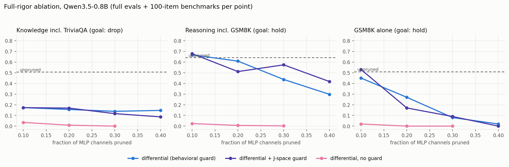
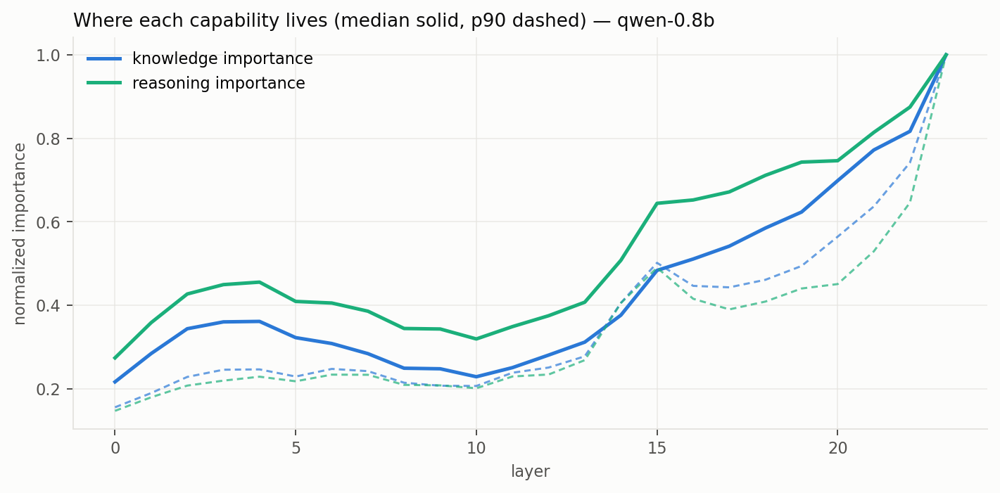

# reasonprune

Prune local LLMs to keep the reasoning engine and shed memorized trivia.

Importance of every MLP channel is measured twice: on closed-book factual
recall, and on in-context reasoning where all facts sit in the prompt.
Channels that knowledge needs but reasoning doesn't get cut; shared circuits
are protected by a guard, including a Jacobian-transport signal derived from
Anthropic's [workspace paper](https://transformer-circuits.pub/2026/workspace/index.html).
Runs entirely on Apple Silicon via MLX.

**Full evidence report (findings, charts, method, caveats):
[latent-variable.github.io/reasonprune](https://latent-variable.github.io/reasonprune/report_built.html)**
(source: `docs/report_built.html`).

## Findings so far (Qwen3.5-0.8B, full-rigor sweep)

| config @10% pruned | knowledge | reasoning | GSM8K | TriviaQA |
|---|---|---|---|---|
| unpruned baseline | 0.506 | 0.641 | 0.51 | 0.12 |
| differential + J-space guard | **0.173** | **0.678** | **0.53** | 0.06 |

- Knowledge drops 66% while reasoning and GSM8K hold at or above baseline.
- Controls behaved: open-book QA intact (recall severed, format fine), tool
  calls 100% at every level, unguarded ratio collapses the model, classic
  low-importance pruning is worse on both axes.
- The J-space guard (sketched Jacobian transport, ~20 min on an M5 Max) beats
  the purely behavioral guard on both axes at 30 to 40% pruning. First use of
  the workspace paper's lens for pruning.
- Honest caveats in the report: perplexity cost, one noisy point at 20%,
  sub-1B models collapse past 30% regardless of guard.





No layer-level split exists (curves travel together), which is why this works
at channel level and whole-layer dropping can't.

## Run

```bash
PY=~/Documents/LatentPlayground/omlx/.venv-codex/bin/python  # pinned mlx venv

$PY scripts/experiment.py baseline --model qwen-0.8b --bench-limit 100
$PY scripts/experiment.py score    --model qwen-0.8b   # importance, both decks
$PY scripts/experiment.py jscore   --model qwen-0.8b   # J-space alignment
$PY scripts/experiment.py sweep    --model qwen-0.8b \
    --strategies diff,diff_jguard,lowmag --fracs 0.1,0.2,0.3 --bench-limit 100
python3 scripts/chart.py --model qwen-0.8b
$PY scripts/slice_model.py --model qwen-0.8b --frac 0.3   # real smaller checkpoint
```

Sweeps are resumable; every run hard-caps MLX memory (`--mem-limit-gb`).
Datasets regenerate deterministically (`reasonprune/datagen.py` + curated
fact tables); benchmark slices via `scripts/fetch_bench.py`.

## Status

0.8B validated end to end. Computed and banked: 27B baseline + importance
scores (knowledge concentrates in layers 55 to 59 of 64, matching ROME/MEMIT).
Gated on owner review: 2B/4B scaling replication, physical slice throughput
measurements, 27B sweep, MoE expert pruning (`reasonprune/moe.py`, the big
memory prize).

Implementation detail and operating contract: `AGENTS.md`. Method and
hypotheses: `DESIGN.md`.
